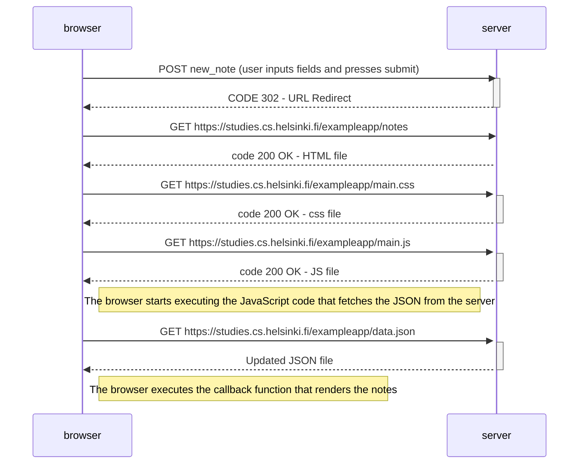

```mermaid
sequenceDiagram
    participant browser
    participant server

    browser->>server: POST new_note (user inputs fields and presses submit)
    activate server
    server-->>browser: CODE 302 - URL Redirect
    deactivate server

    browser->>server: GET https://studies.cs.helsinki.fi/exampleapp/notes
    activate server
    server-->>browser: code 200 OK - HTML file

    browser->>server: GET https://studies.cs.helsinki.fi/exampleapp/main.css
    activate server
    server-->>browser: code 200 OK - css file
    deactivate server

    browser->>server: GET https://studies.cs.helsinki.fi/exampleapp/main.js
    activate server
    server-->>browser: code 200 OK - JS file
    deactivate server

    Note right of browser: The browser starts executing the JavaScript code that fetches the JSON from the server

    browser->>server: GET https://studies.cs.helsinki.fi/exampleapp/data.json
    activate server
    server-->>browser: Updated JSON file
    deactivate server

    Note right of browser: The browser executes the callback function that renders the notes
```